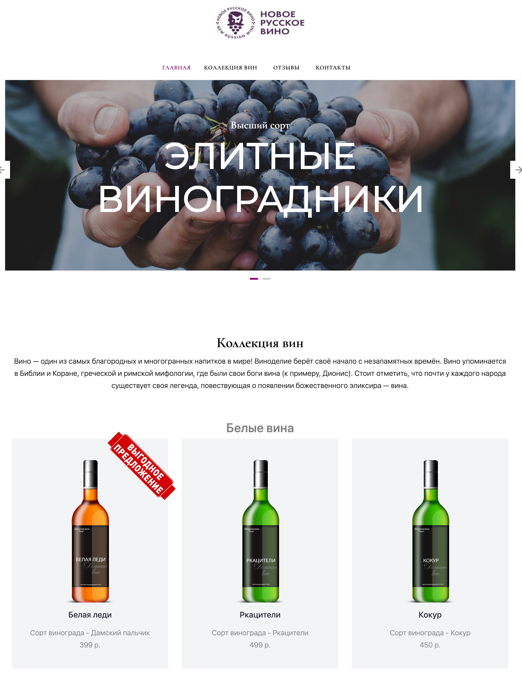

# Новое русское вино

Сайт магазина авторского вина "Новое русское вино".

## Запуск

- Склонируйте код на Ваш компьютер
- Создайте виртуальное окружение проекта:
```commandline
python -m venv env
```
- Активируейте виртуальное окружение:

в Windows:
```
.\env\Scripts\activate
```
в Linux или macOS:
```
source env/bin/activate
```
- Установите зависимости:
```
pip install -r requirements.txt
```
- Откройте файл `wine.xlsx` и заполните по образцу своими данными
- Запустите сайт командой: 
```
python3 main.py -p <filepath>
```
`-p <filepath>` - путь к файлу с Вашими данными, можно не указывать, по умолчанию это `wines.xlsx`.

- Перейдите на сайт по адресу [http://127.0.0.1:8000](http://127.0.0.1:8000).
- Сайт будет выглядеть примерно так:


## Цели проекта

Код написан в учебных целях — это урок в курсе по Python и веб-разработке на сайте [Devman](https://dvmn.org).
